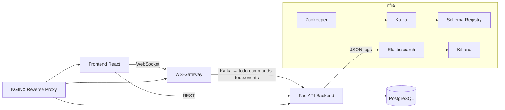

# MicroStack


> Учебный микросервисный проект на FastAPI и React с Kafka, PostgreSQL, Elasticsearch, WebSocket и Docker Compose.

---

## 🧱 Архитектура

Проект состоит из отдельных сервисов, взаимодействующих через Kafka, WebSocket и HTTP.



## 📂 Структура репозитория

```bash 
project-root/
├─ infra/             # docker-compose, Nginx, конфиги
├─ backend/           # FastAPI + Kafka + PostgreSQL
├─ frontend/          # React + Zustand + WebSocket
└─ README.md

```

## 🚀 Стек технологий
- Frontend: React, Zustand, WebSocket
- Backend: FastAPI, SQLAlchemy, aiokafka, Alembic
- База данных: PostgreSQL
- Сообщения: Kafka + Zookeeper + Schema Registry
- Логирование: Elasticsearch + Kibana
- Прокси: NGINX (gzip + кэш + роутинг)
- Тесты: pytest, Selenium
- CI/CD: GitHub Actions
- Контейнеризация: Docker Compose

## ⚙️ Установка и запуск

1. Клонируйте репозиторий
```bash
  git clone https://github.com/your-user/your-repo.git
  cd your-repo
```
2. Подними всё:
```bash
  cd infra
  docker-compose up --build -d
```

3. Проверь доступ:

- http://localhost — Frontend
- http://localhost:8000/docs — Swagger (FastAPI)
- http://localhost:5601 — Kibana
- http://localhost:8081 — Schema Registry


## 🔐 Аутентификация
- POST /auth/register
- POST /auth/login

Тело запроса:

```json
{
"username": "user1",
"password": "pass123"
}
```
Ответ:

```json
{
"access_token": "JWT_TOKEN_HERE",
"token_type": "bearer"
}
```

## 📝 CRUD задачи (Todos)
- GET /todos/
- POST /todos/
- PUT /todos/{id}
- DELETE /todos/{id}

## 🔁 Kafka & WebSocket
Фронтенд отправляет команды через WebSocket:

```json
    {
    "token": "JWT_TOKEN_HERE",
    "action": "delete",
    "record_id": "123"
    }
```
Бэкенд обрабатывает это как асинхронную команду, выполняет операцию и публикует результат в `todo.events`.

## 🧪 Тестирование
- Unit-тесты (backend):

```bash
  pytest backend/tests/unit
```

- Интеграционные тесты (Kafka + DB):
```bash
  pytest backend/tests/integration
```

- E2E-тесты (Selenium + UI):
```bash
  pytest tests/e2e
```

## 🔄 CI/CD (GitHub Actions)
- Запускается на Pull Request в master
- Выполняет:
  - Unit-тесты
  - Integration-тесты
  - Запуск стека + E2E
  - Отчёт
- Деплой в прод после ручного merge


## 📊 Kibana Dashboards
- Index pattern: app-logs-*
- Графики: частота операций, latency, ошибки
- Настройка через localhost:5601
